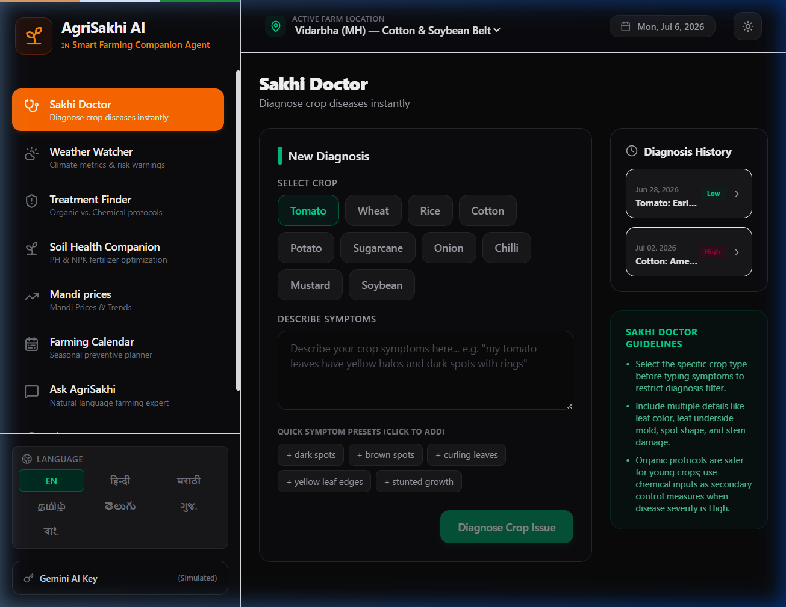
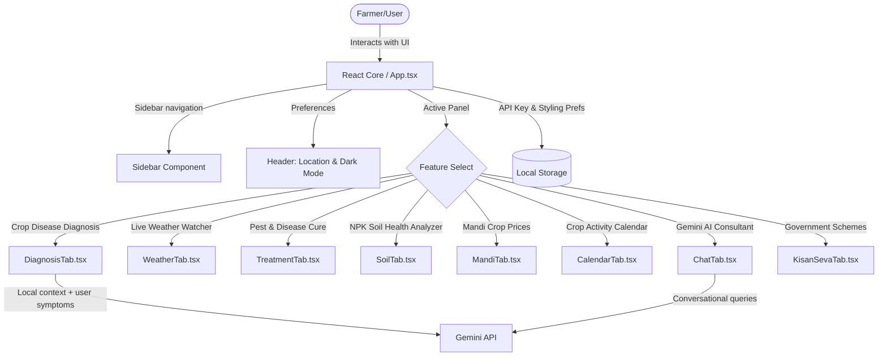

# 🌱 AgriSakhi AI 

> **Empowering Indian Farmers with Intelligent, Localization-First Agricultural Insights.**

AgriSakhi AI is a premium, feature-rich web application designed to assist Indian farmers in managing crop health, monitoring local weather conditions, exploring treatment options, analyzing soil quality, tracking Mandi prices, planning farming calendars, and consulting an AI agricultural specialist in multiple regional languages.

---

## 📸 Application Interface



---

## ⚙️ System Architecture & Workflow

The diagram below illustrates the components of the AgriSakhi AI ecosystem, showing how the frontend coordinates components, hooks into local services, and calls the Gemini API:



---

## ✨ Features

1. **🩺 Sakhi Doctor (Crop Disease Diagnosis)**
   * Scan or select crop types (Rice, Wheat, Cotton, Tomato, Potato).
   * Submit physical symptoms to generate immediate diagnosis reports, severity indicators, and step-by-step action plans.

2. **🌦️ Weather Watcher**
   * Real-time localized weather updates for multiple agricultural hubs (Vidarbha, Khanna, Gondia, Agra, Guntur).
   * Tracks temperature, humidity, wind velocity, and rainfall patterns to guide watering schedules.

3. **💊 Treatment Finder**
   * Curated directory of treatments mapped to various crop diseases.
   * Offers chemical, biological, and preventive solutions.

4. **🧪 Soil Health Companion**
   * Virtual Soil N-P-K (Nitrogen, Phosphorus, Potassium) analyzer.
   * Recommends crop suitability based on pH levels and moisture metrics.

5. **📊 Mandi Prices**
   * Up-to-date market rates and historical trends for essential food grains, vegetables, and cash crops.

6. **📅 Farming Calendar**
   * Seasonal planning tracker.
   * Advises farmers on best windows for sowing, irrigation, weeding, fertilizer application, and harvesting.

7. **💬 Ask AgriSakhi**
   * Conversational chatbot assistant powered by Gemini.
   * Fully contextualized with local weather conditions and crop history.

8. **🏛️ Kisan Seva**
   * Dedicated library of central and state-level government schemes, subsidies, and interactive application steps.

---

## 🛠️ Tech Stack

* **Frontend Framework**: React 19 + Vite 8
* **Programming Language**: TypeScript
* **Styling**: Tailwind CSS v4 (Premium dark-aesthetic layout)
* **Icons**: Lucide React
* **AI Model Engine**: Google Gemini API

---

## 📦 Local Setup & Development

To run the application locally on your machine, follow these steps:

1. **Clone the repository**:
   ```bash
   git clone https://github.com/<your-username>/agrisakhi-ai.git
   cd agrisakhi-ai
   ```

2. **Install dependencies**:
   ```bash
   npm install
   ```

3. **Start the development server**:
   ```bash
   npm run dev
   ```
   Open [http://localhost:5173/](http://localhost:5173/) in your web browser.

4. **Provide your Gemini API Key**:
   * Navigate to the **Sidebar Settings** inside the app.
   * Paste your Gemini API key to enable the interactive agricultural chat.

---

## 🚀 CI/CD GitHub Workflows

The repository includes a GitHub Actions continuous integration workflow configured in `.github/workflows/ci.yml`. 

On every `push` and `pull_request` targeting the `main` branch, the workflow:
1. Provisions a clean Ubuntu container environment.
2. Installs the project node dependencies.
3. Checks for TypeScript compilation errors (`npm run build`).
4. Runs linter checks (`npm run lint`).
