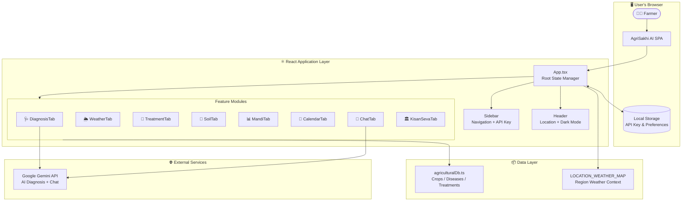
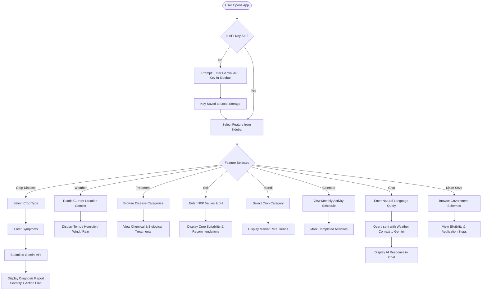
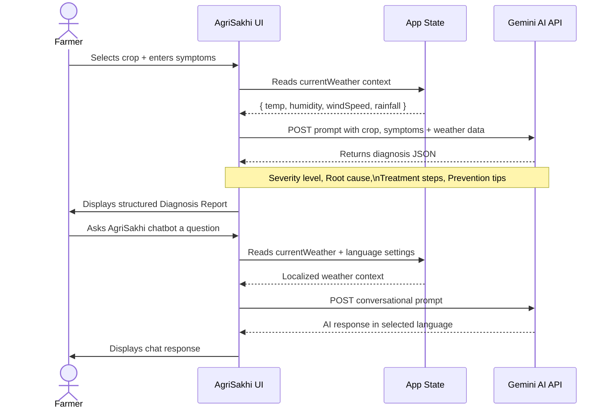
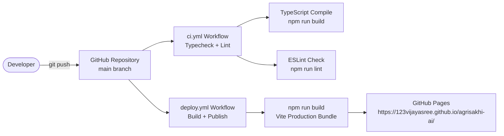

# 🌱 AgriSakhi AI — Project Documentation

> *Empowering Indian Farmers with Intelligent, Localization-First Agricultural Insights*

---

## 📌 Project Overview

**AgriSakhi AI** (कृषि सखी) is an AI-powered agricultural advisory web application designed specifically for Indian farmers. It bridges the gap between traditional farming knowledge and modern technology by providing real-time crop disease diagnosis, weather intelligence, market pricing, soil health analysis, and AI-powered consultation — all in multiple Indian regional languages.

The application is built as a **Progressive Web App (PWA)** using React 19 + Vite, styled with Tailwind CSS v4, and powered by Google's Gemini AI for intelligent conversational and diagnostic capabilities.

---

## 🎯 Problem Statement

Indian farmers face several critical challenges:
- **Lack of timely crop disease diagnosis** leading to significant crop losses.
- **Limited access to localized agricultural advice** in their regional language.
- **Disconnect from real-time market prices (Mandi rates)**, resulting in price manipulation.
- **Inadequate soil health monitoring tools** accessible at the grassroots level.
- **Absence of consolidated farming calendars** tailored to their region and crops.

AgriSakhi AI addresses all of these in one unified, offline-friendly web platform.

---

## ✨ Key Features

| Feature | Description |
|---|---|
| 🩺 **Sakhi Doctor** | AI-powered crop disease diagnosis using symptom input |
| 🌦️ **Weather Watcher** | Real-time weather for 5 major farming regions in India |
| 💊 **Treatment Finder** | Disease-to-treatment mapping with chemical & biological options |
| 🧪 **Soil Health Companion** | NPK analysis and crop suitability recommendations |
| 📊 **Mandi Prices** | Live and historical market rates for major crops |
| 📅 **Farming Calendar** | Seasonal activity tracker for sowing, irrigation, and harvest |
| 💬 **Ask AgriSakhi** | Gemini-powered conversational AI assistant |
| 🏛️ **Kisan Seva** | Government schemes, subsidies and application guides |

---

## 🗂️ Project Structure

```
agrisakhi-ai/
├── public/
│   ├── favicon.svg
│   └── icons.svg
├── src/
│   ├── assets/              # Static image assets
│   ├── components/
│   │   ├── CalendarTab.tsx  # Farming calendar feature
│   │   ├── ChatTab.tsx      # Gemini AI chatbot
│   │   ├── DiagnosisTab.tsx # Crop disease diagnosis
│   │   ├── Header.tsx       # Top bar (location, dark mode)
│   │   ├── KisanSevaTab.tsx # Government schemes portal
│   │   ├── MandiTab.tsx     # Market price tracker
│   │   ├── Sidebar.tsx      # Navigation + API key input
│   │   ├── SoilTab.tsx      # Soil health analyzer
│   │   ├── TreatmentTab.tsx # Treatment finder
│   │   └── WeatherTab.tsx   # Weather dashboard
│   ├── data/
│   │   └── agriculturalDb.ts # Crop, disease & treatment database
│   ├── App.tsx              # Root component + state management
│   ├── main.tsx             # React DOM entry point
│   └── index.css            # Global styles + dark mode tokens
├── .github/
│   └── workflows/
│       ├── ci.yml           # CI: Typecheck + Lint
│       └── deploy.yml       # CD: Deploy to GitHub Pages
├── images/
│   └── screenshot.png       # App preview screenshot
├── Dockerfile               # Docker container for Cloud Run
├── vite.config.ts           # Vite build config with base path
├── README.md                # Repository documentation
└── project.md               # This file
```

---

## 🏗️ System Architecture



---

## 🔄 User Interaction Flow



---

## 🌍 Localization Support

AgriSakhi AI supports **7 Indian languages**:

| Code | Language |
|------|----------|
| `en` | English |
| `hi` | हिन्दी (Hindi) |
| `mr` | मराठी (Marathi) |
| `ta` | தமிழ் (Tamil) |
| `te` | తెలుగు (Telugu) |
| `gu` | ગુજરાતી (Gujarati) |
| `bn` | বাংলা (Bengali) |

---

## 🌏 Supported Agricultural Regions

| Region | State | Weather Data |
|--------|-------|-------------|
| Vidarbha | Maharashtra | Temp: 29°C, Humidity: 82%, Rainfall: 18mm |
| Khanna | Punjab | Temp: 28°C, Humidity: 48%, Rainfall: 0mm |
| Gondia | Maharashtra | Temp: 24°C, Humidity: 92%, Rainfall: 45mm |
| Agra Rural | Uttar Pradesh | Temp: 19°C, Humidity: 88%, Rainfall: 4mm |
| Guntur | Andhra Pradesh | Temp: 34°C, Humidity: 55%, Rainfall: 0mm |

---

## 🤖 AI Integration Flow



---

## 🚀 CI/CD Pipeline



---

## 🛠️ Tech Stack

| Layer | Technology |
|-------|-----------|
| Framework | React 19 |
| Build Tool | Vite 8 |
| Language | TypeScript |
| Styling | Tailwind CSS v4 |
| Icons | Lucide React |
| AI Engine | Google Gemini API |
| CI/CD | GitHub Actions |
| Hosting | GitHub Pages |

---

## 📦 Local Development Setup

```bash
# 1. Clone the repository
git clone https://github.com/123vijayasree/agrisakhi-ai.git
cd agrisakhi-ai

# 2. Install dependencies
npm install

# 3. Start the development server
npm run dev

# 4. Open in browser
# http://localhost:5173/
```

> **Note**: Enter your [Google Gemini API Key](https://aistudio.google.com/app/apikey) in the sidebar settings to enable AI features.

---

## 🌐 Live Application

**GitHub Pages URL**: [https://123vijayasree.github.io/agrisakhi-ai/](https://123vijayasree.github.io/agrisakhi-ai/)

**GitHub Repository**: [https://github.com/123vijayasree/agrisakhi-ai](https://github.com/123vijayasree/agrisakhi-ai)

---

## 👩‍💻 Author

| Name | GitHub | Email |
|------|--------|-------|
| G. Vijayasree | [@123vijayasree](https://github.com/123vijayasree) | gvijayasreegvijayasree90@gmail.com |

---

*AgriSakhi AI — Built with ❤️ for India's farming community.*
